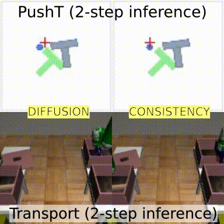
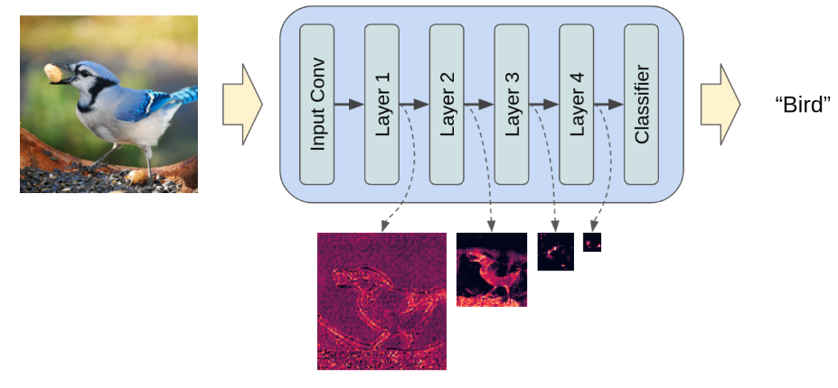
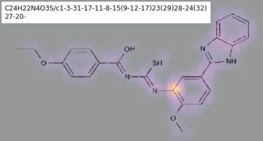
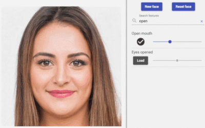
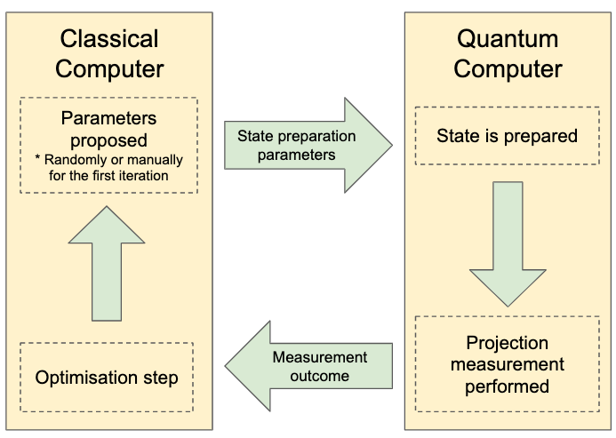

I started my career in experimental quantum computing with a Master's degree and a few publications in noise-tolerant quantum control of trapped-ion qubits. I took 5 years to try my hand at the world of business and startups, part of which involved launching the international expansion of a Spanish logistics startup in the UK. It was a blast, but not enough to keep me from being drawn back to my technical/analytical roots. In 2019 I watched the [AlphaGo](https://www.youtube.com/watch?v=WXuK6gekU1Y) documentary, trained some reinforcement learning agents in [gym](https://www.gymlibrary.dev/), and trained an [MNIST](https://en.wikipedia.org/wiki/MNIST_database) classifier. The ML bug got a hold of me, and I haven't looked back since.

# Projects

I love to explore and contribute to the ML ecosystem whenever I can. See below for some highlights of my public work. For a summary of my professional curriculum, please see my [LinkedIn](https://www.linkedin.com/in/alexander-soare-996145a7/).

## Hugging Face's LeRobot

Throughout 2024 I was a member of Hugging Face's robotics team and was a core contributor to their open source robotics library [LeRobot](https://github.com/huggingface/lerobot). I mainly focussed on modeling, training, and evaluation. To add my own personal touch to this work, I started a repository of [little experiments](https://github.com/alexander-soare/little_experiments) where I did deep dives into various aspects of robot learning models.

## Consistency Policy

I distilled [Diffusion Policy](https://diffusion-policy.cs.columbia.edu/)s into consistency models. This was part of a push for me to understand diffusion models in depth. See [the writeup and code here](https://github.com/alexander-soare/consistency_policy).

## Contributed [TorchVision FX feature extraction](https://pytorch.org/vision/stable/feature_extraction.html)

This contribution leverages PyTorch's [symbolic tracing toolkit](https://pytorch.org/docs/stable/fx.html) to provide a compact and intuitive API for extracting hidden layers from TorchVision models.

I authored a related [blog post](https://pytorch.org/blog/FX-feature-extraction-torchvision/) in the official PyTorch blog.

I also made a [YouTube tutorial](https://www.youtube.com/watch?v=QRQBTkCLpFY).

## Contributions to [timm](https://github.com/huggingface/pytorch-image-models)

`timm` is **the** go-to library for SOTA vision backbones in PyTorch. Some of my contributions include:

- Porting [Nested Hierarchical Transformers](https://github.com/google-research/nested-transformer) from the official Jax implementation.
- Adapting [XCiT](https://github.com/facebookresearch/xcit).
- Adding support for [FX feature extraction](https://pytorch.org/vision/stable/feature_extraction.html).
- Developing a [handy little utility for freezing and unfreezing model weights](https://github.com/huggingface/pytorch-image-models/blob/8a713b09e5ee917a4b2379738d4f2afefc64e276/timm/utils/model.py#L106-L222) while handling batch-norm parameters separately.

## Educational content on YouTube

I believe in teaching to learn, so I occasionally record a screencast of myself explaining an ML concept. Check out [my YouTube channel](https://www.youtube.com/@alex-ai7517). This [video on understanding attention in transformers](https://www.youtube.com/watch?v=H-4bmOxiKyU) has been particularly popular.

## Kaggle competitions

Kaggle was a great resource for spinning up my ML knowledge.

In the [Bristol Myers Squibb - Molecular Translation competition](https://www.kaggle.com/c/bms-molecular-translation/overview) I landed 27th place (9th amongst solo competitors). For this GIF, I visualize one of the attention maps in my vision transformer + text decoder while it transcribes the molecule's international chemical identifier.

30th place in [Kaggle's Global Wheat Detection competition](https://www.kaggle.com/c/global-wheat-detection).

## Interactive web demo of [GANSpace](https://arxiv.org/abs/2004.02546)

After doing a short introductory course to [Angular](https://angular.io/), I flexed my skills with a web-based front-end that would allow users to flexibly tune attributes of a GAN's output. At the time this was mind-blowing stuff for the general population and computer vision practitioners alike (can you believe that was just 2019!).

## A tutorial on the Variational Quantum Eigensolver

Just before jumping into ML, I took a quick detour back to quantum computing to check what I'd missed. I'm a strong believer in teaching to learn. So I made a tutorial on VQEs. Check it out [here](https://github.com/alexander-soare/framework-agnostic-vqe-tutorial).

